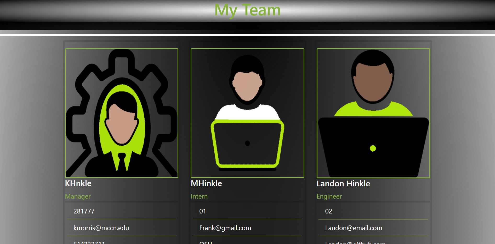

# Team Profile Generator

    
## [Description](#description)
    
 This teaam profile makes it easier for a development team to create a roster that indicates the particulars about each member of the team.
    
### Motivation
    
The Motivation for creating this application comes from the need of managers to be more effective and efficient when obtaing and tracking employees of a team and their information.
    
### Problems Solved 
    
One of the most challenging problems that I encountered occured as I attempted to extend a superclass and overwrite the properties and methods it contained whithin a child class. 
    
### What I learned 
    
I learned to better understand the full scope of programming and how an app can be created to effect multiple entities at a time, ie.(how you can answer questions in the command line interface and those answers can be used for multiple purposes like creating a web page and a databse at the same time.)
    
## [Table of Contents](#table-of-contents)
 
    
1. [Installation](#installation)
    
1. [Usage](#usage)
    
1. [Demo](#demo)
    
1. [Test](#test)
    
1. [Badges](#badges)
    
1. [Features](#features)
    
1. [Contributors](#contributors)
    
1. [Contribute](#contribute)
    
1. [Questions](#questions)
    
1. [License](#license)

    
## [Installation](#installation)
    
Get the source files from this github repository (https://github.com/llh9/Team-Profile-Generator). Then open the folder in an IDE like VSCode and run it.
    
## [Usage](#usage)
    
Open the command line interface in the IDE and type in the command "node index.js". Afterwards, a series of questions will be presrnted to the user (you) at which time you are to fill in the information about yourself (the manager of a development team). Then you will be asked to choose the type of employee that you will hire next. Either the team member or you can enter the information for this additional employee. This process is repeated untill the entire team's information has been recorde at which time the manager selects the done option form the options list. When you select the done option, the application uses the infomation to build a web page containing profiles for each of the team members who recorded their information. Throughout the process, previews of the recorded information is presented to the user via the command line so that you can verify the provided information is correct.
    
## [Walkthrough Video](https://watch.screencastify.com/v/Go5noiMvoTSbXNTxSbFR)
    
### [Demo Screenshot](#demo-screenshot-1)
    

    
## [Test](#test)
    
Tests have yet to be created.
    
## [Badges](#badges)
    

    
You can get badges hosted by [shields.io](https://shields.io/). 
    
## [Features](#features)
    
If your project has a lot of features, list them here.
    
## [Contributors](#contributors)
    
Landon Hinkle
    
## [Contribute](#contribute)
    

    
If you created an application or package and would like other developers to contribute it, you can include guidelines for how to do so. The [Contributor Covenant](https://www.contributor-covenant.org/) is an industry standard, but you can always write your own if you'd prefer.
    
## [Questions](#questions)
    
https://github.com/llh9/Team-Profile-Generator
    
## [License](#license)
    
This project was created under the ISC license.
    